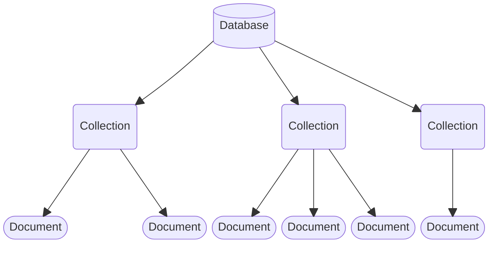

# Databases, Collections And Documents

[PoloDB](https://github.com/PoloDB/PoloDB) has a hierarchical structure.

The topmost level is a *Database*.
A Database may contain multiple *Collections*.
A Collection may contain multiple *Documents*.
A Document is of type [JSON](https://www.json.org/).
It is possible to have Documents of custom types.

:arrow_right:  Next: [Opening Databases In Memory](./opening_databases_in_memory.md)

:blue_book: Back: [Table of contents](./../README.md)
